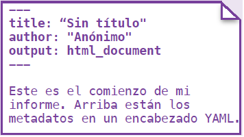
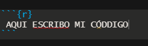
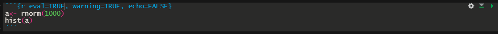

```{r setup, include=FALSE}
knitr::opts_chunk$set(echo = TRUE)
```


<style>
table {
background-color:#FFFFFF;
}
</style>

<style>
.list-group-item.active, .list-group-item.active:focus, .list-group-item.active:hover {
    background-color: darkblue;
}
</style>

<button onclick="document.body.scrollTop = document.documentElement.scrollTop = 0;" style="
    position: fixed;
    bottom: 5px;
    right: 40px;
    text-align: center;
    cursor: pointer;
    outline: none;
    color: #fff;
    background-color: #0A71A0;
    border: none;
    border-radius: 15px;
    
">Ir arriba</button>

 

El presente tema abarca la aplicación del R Markdown. 

Se abordarán los siguientes temas:

- Qué es un Markdown.
- Qué es el R Markdown.
- El espacio de trabajo --- Creando un Markdown.
- La estructura del .rmd
- El YAML.
- Escribir en el .rmd --- el Pandoc.
- Insertar código --- el chunk.
- Algunas aplicaciones adicionales.

Al finalizar la sesión podrá aplicar cualquier documento reproducible a partir de un R Markdown, y sobre todo, mejorará la forma en que suele presentar los diversos documentos, siguiente utilizando el ide de R Studio.

 

# 0. ¿Qué es un Markdown? 

Markdown es una forma sencilla de agregar formato a textos web. Con formato nos referimos a itálicas, negritas, listas, y más, en texto plano –por ejemplo, el texto que nos encontramos en el visor de HTML de los editores de blogs, o en el Bloc de Notas de Windows, para hacer el concepto más asequible-. 

Markdown fue creado originalmente por John Gruber, con ayuda de Aaron Swartz, con el propósito de crear un texto plano fácil de escribir y fácil de leer, y que pudiera convertirse de forma sencilla y válida a XHTML.

En un principio, la idea de sus creadores era fundar una alternativa a HTML, pero termino mutando. 

¿Qué es Markdown? --> Entonces: es una forma de crear páginas web sin tener experiencia en HTML, por ejemplo. 

Qué es Markdown, también: un sistema de procesado de textos sencillo y minimalista que nos permite escribir rápido sin prestar demasiada atención al formato. Funciona a través de determinadas porciones de texto que tenemos que insertar para que se pueda leer bien en HTML.

La flexibilidad del Markdown produjo que otros programas como Python, Julia, C++ y hasta R utilizaron su plataforma base para crear su propia aplicación de Markdown.

# 1. ¿Qué es el R Markdown?

R Markdown es un extensión del R Studio o formato que permite una fácil creación de documentos, presentaciones dinámicas y informes de R. Markdown es un formato de sintaxis simple para crear documentos tipo ,HTML, PDF, y Word, entre otros. Aunque más adelante veremos la gran expansión que este ha tenido.

En un inicio un archivo R Markdown (.rmd) se pensaba como un registro para la investigación (creado para un mundo académico). Este contiene el código que un científico necesitaba para reproducir su trabajo junto con la narración que un lector necesita para comprender los análisis. Este es el principio de la Investigación Reproducible. 

Finalmente, mediante el R Markdown se puede elegir exportar el informe terminado en una variedad de formatos, incluidos documentos html, pdf, MS Word o RTF; diapositivas basadas en html o pdf, cuadernos y más... veamos las diversas aplicaciones que se pueden generar a apartir de un archivo .rmd o Markdown. 


¡Qué cool verdad!

Para instalar y hacer uso del R Markdown se necesita:

1. La versión mas reciente de R.
2. R Studio.
3. Instalar los paquetes  knitr y rmarkdown.
4. "Conocimientos" básicos del Markdown.


**¿Qué es el knitr?**

"knitr" una herramienta o paquete para generación de informes dinámico en R. 

Es un paquete en el lenguaje de programación estadístico R que permite integrar R en documentos LaTeX, LyX, HTML, Markdown, AsciiDoc, y reStructuredText. 

El propósito de knitr es dar espacio a la reproducibilidad de investigación en R a través de Programación Literaría.

Por tanto, aunque solemos hablar de *R Markdown*, en su uso este siempre está acompañado del knitr, tanto así que el permite la "salida" del documento es el knitr. Pero la configuración de trabajo la llamamos ".Rmd".

En la reproduciblidad de un documento utilizamos: rmarkdow, knitr, y nuestro script ahora no será un *.r* sino un *.rmd*.

# 2. El espacio de trabajo --- Creando un Markdown

Por espacio de trabajo (Workflow) se refiere a los componentes que forman la aplicación del R Markdown. Se pueden ver en la siguiente imagen.


 1. Abrir un nuevo .rmd

Para iniciar un nuevo .rmd vamor a "File" -> "New File" -> "R Markdown"


Utilice el wizard para abrir un tipo de documento o archivo de salida entre los enlistados. 


 2. Escribir en el archivo *.rmd*: editar o especficiar el .rmd

 3. EL knitr para crear o lanzar el reporte: el botón del Knit permite lanzar el documento seleccionado.

 4. La generación del reporte por el Knitr: es el reporte creado.

 5. La publicación (opcional): ¿subirlo a la web... por qué no?

 6. Examinar el log o sistaxis propias al Markdown: posibles errores o corridas de cada chunk (¿?) serán presentados ahí.

 7. Los archivos de salida: gráficos y otros, se guardarán en los archivos de salida del .Rmd 

## Uno sobrealiente...

Hay uno que sobre sale y es el "2. Escribir en el archivo .rmd", dado que este es el que posee toda la configuración respectiva del documento de salida. 

Lo siguiente será ver la estructura del *.Rmd*

# 3. La estructura del .rmd

El .Rmd se caracteriza esencialmente por 3 partes:

- YAML
- Texto o Pandoc
- Y el código o los chunks


Esta es la esencia del .rmd, y donde toda la configuración sucede. 

Vaemos en detalle cada una de las parte.

# 4. El YAML

El YAML es el inicio de un archivo .Rmd.

Es el encabezado de un conjunto de pares o llave (llamémoslos opciones). 

El YAML comienza y termina el con tres rayas (- - -).

Es importante resaltar que el generador de plantillas del R Studio realmente es una configuración del YAML para la llave u opción de "output:". Las opciones son 

- output: html_document --> archivo html (página web)          
- output: pdf_document --> archivo pdf
- output: word_document --> Microsoft Word .docx
- output: beamer_presentation --> presentación beamer (pdf)
- output: ioslides_presentation --> presentación ioslides (html)
- Entre otras opciones....  

Veamos un ejemplos de YAML.



Veamos el YAML del presente .Rmd


Las opciones o configuraciones de un YAML pueden ser muchas...

El siguiente enlace presenta una guía exhaustiva de los campos posibles en el YAML:

https://cran.r-project.org/web/packages/ymlthis/vignettes/yaml-fieldguide.html


# 5. Escribir en el textp .rmd --- el Pandoc

En la edición de texto existen tantas o más formas que las presentadas por Word.... así es.

Veamos algunos ejemplos 

## Texto plano

Esto es un texto plano, sin ningún símbolo u otro carácter especial.

## Nuevo párrafo 

Termina una línea con dos espacios para comenzar un nuevo párrafo.


Veamos el este ejemplo  

Ahora acá inicia el 2nd párrafo

## Itálica 

Encerramos la o las palabras con un * 

*Este es el ejemplo*

## Sombreado

Encerramos la o las palabras con dos **

**Este es el otro ejemplo**

## Códigio verbatim 

El código verbatim es para poner un fondo gris claro. Encerramos la o las palabras con `

`Este un un verbatim`


## Sub y súper índices

Para los sub índices utilizamos los elementos encerrados por ~ 
Para los súper índices utilizamos los elementos encerrados por ^

Este es un ejemplo de un sub índice ~algo~
Este es un ejemplo de un sub índice ^otro^
Acá vemos a ambos al mismo tiempo ^2^~2~

## Rayado de la palabra 

Utilizamos los elementos encerrados por dos ~~ (sin espacio)

~~acá estamos rayando~~

## Para poner un guión largo o endash 

Utilizamos dos guiones -- o más 

endash: --, emdash: ---

## Para una ecuación matemática

Colocamos la ecuación entre signos de $

Ecuación : $A = \pi*r^{2}$


## Ecuación matemática en bloque

Colocamos la ecuación entre dos signos de $

$$E = mc^{2}$$
Vemos que la ecuación de bloque centra y resalta la ecuación.

Para conocer todas las notaciones matemáticas, letras griegas u otros, ver el siguiente enlace:

http://csrgxtu.github.io/2015/03/20/Writing-Mathematic-Fomulars-in-Markdown/

## Los bloques 

Utilizamos el signo de >

> Esto es un nota de bloque

## Los encabezados

Para los encabezados utilizamos los # al inicio. Entre más # es que el encabezado posee una menor jerarquía veamos

## Encabezado 1

### Encabezado 2

#### Encabezado 3

##### Encabezado 4

###### Encabezado 5

####### Encabezado 6


## Comentarios de texto

Para poner comentarios en el texto, sin que salga en el reporte debemos encerrar el texto entre  <! --   --> sin empacio

<!--Text comment-->

Verificar luego esto viendo el .Rmd

## Colocar una imagen

Para esto utilizamos lo forma 

```{r eval=FALSE}
""
```

Por ejemplo, voy a poner una imagen que se llama "r-icon-8" y su extensión es .jpg


## Índeces

**Como se ven en Markdown**

```{r eval=FALSE}
* unordered list
* item 2
    + sub-item 1
    + sub-item 2
1. ordered list
2. item 2
    + sub-item 1
    + sub-item 2
```

**Como se ve en el documento generado**

* unordered list
* item 2
    + sub-item 1
    + sub-item 2
1. ordered list
2. item 2
    + sub-item 1
    + sub-item 2
    
Para los índices se pueden utilizar "-" "números", "+", "-", "@" y otros.
    
## Tablas    

Tenemos  la opción de crear tablas:


**Como se ven en Markdown?**

```{r eval=FALSE}
Table Header  | Second Header
------------- | -------------
Cell 1        | Cell 2
Cell 3        | Cell 4
```

**Como se ve en el documento generado**


Table Header  | Second Header
------------- | -------------
Cell 1        | Cell 2
Cell 3        | Cell 4

## Los puntos en listas (side bullets)

Para hacer una lista con puntos, bastan con poner un "-" espacio y escrbrir. Vean este ejemplo

- Tema 1
- Tema 2
- ...
- Tema 14523453236546

## Una regla horizontal

Podemos crear una regla horrizontal con diversos tamaños ha realizar uniones de 2 o más "-". Por ejemplo

-----------
--------------------
------------------------------
--------------------------------------------
--------------------------------------------------------------
-----------------------------------------------------------------------------------

# 6. Insertar código --- el chunk

A partir de este punto es que toda la magia sucede! 

Existen tres formas de insertar el código en el .Rmd 

## Insertando en el texto - Pandoc

Para esto escribimos:  

```{r eval=FALSE}
 **`r <code>`** en el editor de texto.
```


en el editor de texto.

Solicitemos a R su versión mediante la función getRversion(): R--- `r getRversion()`


## Las opciones globales 

El primer chunk es diferente a los demás:


En este especificamos opciones globales tales como instalación de programas, cargar librerías, especificar directores, archivos de lectura, y todas las opciones globales pertinentes para empezar nuestro espacio de trabajo. 

Aún sea un forma global, de igual a forma procesamos código.

## Los chunks

Un chunk es una opción emergente para editar código:


Dentro del chunk podemos trabajar códigos:

- R
- Python
- SQL
- Bash
- Rcpp
- Stan
- JavaScript
- CSS
- otros...



Y es en el chunk que editamos todo el código que queramos!

De igual forma, en el chunk podemos especifidcar diversas opciones como no mostrar el código, evitar los WARNINGS, no procesar el código, etc

Veamos un ejemplo donde utilizamos las funciones eval, warning y echo



Este chunk produce el siguiente resultado:

```{r eval=TRUE, warning=TRUE, echo=FALSE}
a<- rnorm(1000)
hist(a)
```

La función "eval" indique si debe o no evaluar el chunk, "warning" indique si debe o no mostrar los warnings, y "echo", si debe o no mostrar el chunk en el reporte. 

Un resumen de las funciones más importantes :


Para más detalle ir al enlace: 

yihui.name/knitr/

¿Qué es lo importante de todo esto?

# 7. Ir más allá

R Markdown es una herramienta muy poderosa. Además de lo visto anteriormente se pueden crear:

- Citaciones bibliográficas
- Templates personalizados 
- Documentos con enlaces (enlaces tabsets)
- Lista de parámetros 
- Documentos interacticos con aplicaciones de Shiny
- Libros... (¡sí todo un libro!)
- Y muchas cosas más...!

La siguiente imagen muestra algunos posibles usos del R Markdown:


# 8. Veamos algunas salidas del Markdown

Veamos el caso por "default" de una salida Markdown de un documento:

- world 
- pdf 
- html
- ioslides.

# 9. REF

Alguos sitios web por consultar:

- https://bookdown.org/yihui/rmarkdown/
- https://rmarkdown.rstudio.com/articles_intro.html
- https://rmarkdown.rstudio.com/
- https://rstudio.com/wp-content/uploads/2015/03/rmarkdown-spanish.pdf
- https://medium.com/@itsjzt/beginner-guide-to-markdown-229adce30074
- https://rmarkdown.rstudio.com/lesson-1.html
- https://rstudio.com/wp-content/uploads/2016/03/rmarkdown-cheatsheet-2.0.pdf
- https://rmarkdown.rstudio.com/lesson-15.html


